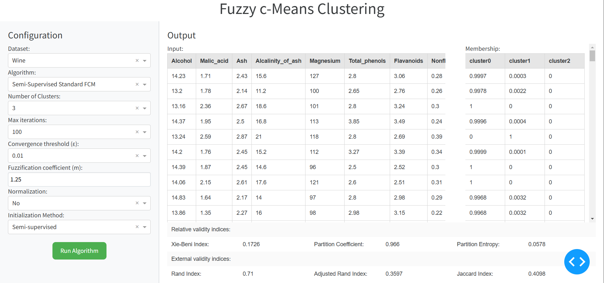

# Unsupervised & Semi-supervised Fuzzy c-Means Clustering <a name="fcm"></a>

## Table of Contents
* [Unsupervised & Semi-supervised Fuzzy c-Means Clustering](#fcm)
	* [About](#about)
	* [Usage](#usage)


## About <a name="about"></a>

This package contains the code to three clustering algorithms Fuzzy c-Means (FCM), Semi-Supervised Standard Fuzzy c-Means (sSFCM) and  Semi-Supervised Entropy Regularized Fuzzy c-Means (eSFCM). There is also an UI for easier configuration and comparison of clustering performances.

## Usage <a name="usage"></a>
To infer an image, follow these steps:

1. Clone the repository:\
   ```https://github.com/ankhanhtran02/Unsupervised-Semi-supervised-Fuzzy-c-Means-Clustering.git```
2. Navigate to the project directory:\
   ```cd Unsupervised-Semi-supervised-Fuzzy-c-Means-Clustering```
3. Run the app:\
   ```python3 app.py```
You should see a tab pop up on your browser like below:

4. Choose your configurations and click "Run Algorithm".

